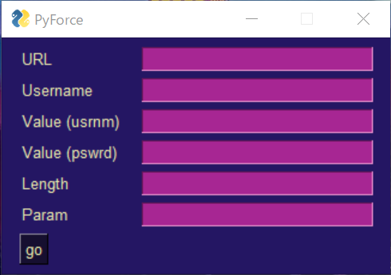
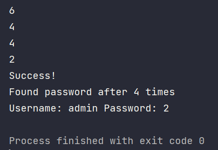
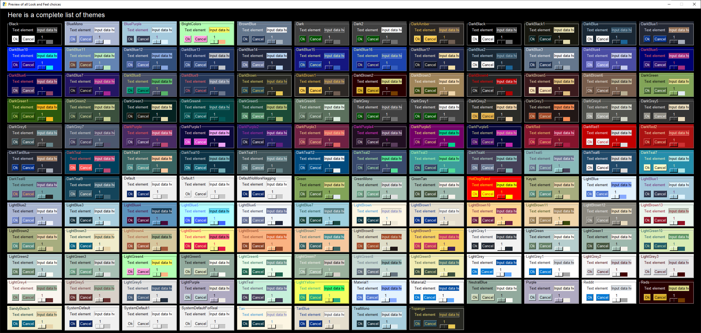

# PyForce

PyForce is a simple program that brute forces any website. It also supports many themes.


## How to install

```cmd
$ python -m pip install requests PySimpleGUI random-password-generator
```

## Setting up

When you first run the program, a window like this should pop up.



**If you want to change the theme, go down to [how to customize](#How to customize).**

The GUI consists of 6 input boxes:

* URL
* Username
* Value for the username
* Value for the password
* The length of the password
* Parameters

### URL

Enter the URL of the website that you want to brute force.

### Username

Enter the username of the victim.

### Values

Enter the values of each credentials.

```html
<form method="post">
	<input name="usr" type="text">
	<input name="pas" type="text">
	<button type="submit">Submit</button>
</form>
```

In the above example the values would be `usr` for the username and `pas` for the password.

### Length

Enter the length of the password.

### Parameter

For the parameter, you must enter the desired letters to add to the password generator. 

| Parameter | Meaning           |
| --------- | :---------------- |
| U         | Uppercased Letter |
| L         | Lowercased Letter |
| D         | Digits            |

For example, if you want lowercased letters and digits, enter `LD` or `DL`.

## How to use

To test PyForce, I recommend hosting your own server via [XAMPP](https://www.apachefriends.org/). After installing it, add this PHP code as `index.php`.

```php+HTML
<?php
if ($_POST[usr] == "admin" and $_POST[pas] == "2"){
	print "true";
}
else{
	print "false";
}
?>
<form method="post">
	<input name="usr" type="text">
	<input name="pas" type="text">
	<button type="submit">Submit</button>
</form>
```

All you have left to do is type in the info and you're good to go.

Once a match is found, the windows will close and a log will be left on the shell.



## How to customize

To change the theme, change the `sg.theme()` to the theme that you want. For example:

```python
sg.theme('DarkBlue7')
```



